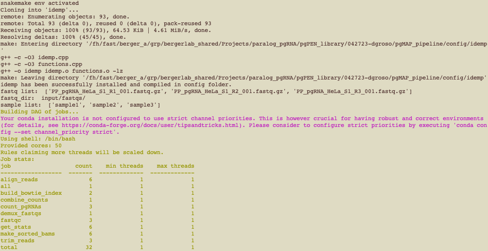
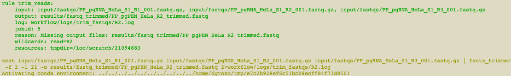

# pgMAP (paired guide RNA MAPper) Pipeline

## Running the pipeline

1. Clone or fork the git repo from https://github.com/FredHutch/pgMAP_pipeline/ (if you are not sure of the difference between cloning and forking, check out the explainer [here](https://github.com/FredHutch/pgMAP_pipeline/)). Make sure you are on the main branch. 


2. Update the config files as described below: Duplicate the following files and edit them so that the barcodes and samples match those used in your sequencing run and all file paths point to your working directory:
    * Make a copy of `barcode_ref_file.sample.txt` named `barcode_ref_file.txt`. Update the sample and barcode information to match your experimental design and sequencing setup. 
    * Make a copy of `config.sample.yaml` named `config.yaml`. Update the `base_filename` variable, the read coordinates, and the number of chunks to split your BAM files into. 


3. **First time only:** Build a Conda environment for Snakemake (defined by `workflow/envs/snakemake.yaml`, for more detail see the [Snakemake documentation](https://snakemake.readthedocs.io/en/stable/getting_started/installation.html)). Running your analysis within `snakemake_env` will enable you to use the same version of Snakemake and all other supporting packages as we used when we developed pgMAP. To build the `snakemake_env`, do one of the following: 
   1. Install [Mamba](https://mamba.readthedocs.io/en/latest/), which is essentially a faster version of Conda that is required to run Snakemake, by doing one of the following:
      * If you **do not** already have the Conda package manager installed, [install Mambaforge](https://github.com/conda-forge/miniforge#mambaforge)
      * If you **do** already have Conda installed, run the following command: `$ conda install -n base -c conda-forge mamba`
   2. Next, create your Snakemake environment using Mamba by either:
      * Running the command `mamba env create -f workflow/envs/snakemake.yaml`
      * Un-commenting line 16 in the script `run_snakemake.sh` (command: `# mamba create -f $CONDA_ENV`)


4. Run the script `run_snakemake.sh` by entering the command: `bash run_snakemake.sh`


### More info on installing/running/troubleshooting Snakemake
Install Snakemake v7.1.0 using mambaforge as described here:
https://snakemake.readthedocs.io/en/stable/tutorial/setup.html

Folder setup/running info as described here:
https://snakemake.readthedocs.io/en/stable/snakefiles/deployment.html

## pgMAP Tutorial
1. Downsampled pgPEN screen fastq files will be used in the example, and can be found in `input/fastqs`:

* PP_pgRNA_HeLa_S1_R1_001.fastq.gz
* PP_pgRNA_HeLa_S1_R2_001.fastq.gz
* PP_pgRNA_HeLa_S1_R3_001.fastq.gz

2. In `config/barcode_ref_file.txt`, paste the following as tab-separated values (please note that copy-pasting from this markdown will not preserve tabs):
```
ACTTGA   sample1
CTTGTA   sample2
GGCTAC   sample3
```
These barcodes are used in the demultiplexing step of the pipeline and are unique to each sample and condition. If using pgMAP for your own applications, please be sure to update `barcode_ref_file.txt` accordingly. Note that the barcode and sample ID *must be separated by a single tab*).

3. In `config/config.yaml`, ensure that variable `base_filename` corresponds to `PP_pgPEN_HeLa`. If using pgMAP for your own applications, please be sure to update `base_filename` accordingly.

4. pgMAP is now ready to run. Execute `run_snakemake_test.sh` on an interactive node or other server intended for computationally intensive tasks [note: could provide guidance on number of cores here] : 
```
. run_snakemake_test.sh
```
Additionally, to schedule a slurm job for pgMAP, execute `run_snakemake_cluster.sh`:
```
. run_snakemake_test_cluster.sh
```
pgMAP will automatically install all required packages with dependencies. Snakemake will print output as the processes run:
&nbsp;&nbsp;&nbsp;&nbsp;&nbsp;&nbsp;&nbsp;&nbsp;&nbsp;&nbsp;&nbsp;&nbsp;&nbsp;&nbsp;&nbsp;&nbsp;&nbsp;&nbsp;

Snakemake will detail each step that is being run, including any errors that arise: 
&nbsp;&nbsp;&nbsp;&nbsp;&nbsp;&nbsp;&nbsp;&nbsp;&nbsp;&nbsp;&nbsp;&nbsp;&nbsp;&nbsp;&nbsp;&nbsp;&nbsp;&nbsp;


The resulting pgRNA counts files can be found in `results/pgRNA_counts`:

| id  | seq_1 | seq_2 | counts_sample1 | counts_sample2 | counts_sample3 | 
| ------------- | ------------- | ------------- | ------------- |------------- |------------- |
|AADAC_AADACL2_pg1   |AAGTCTGAAGCACTAAGAAG   |AAAGAAAGTCAGAAACCCGA|  5 |  6 |  4|
|AADAC_AADACL2_pg10	|ATTTCTATCCAAATCACTCA	|GAAAAAATTTGACTGCAGCA|  4 |  2 |  6|
|AADAC_AADACL2_pg11	|ATTTCTATCCAAATCACTCA	|GTGATGTATTCATCTGAAAG|	0 |  2 |  3|
|AADAC_AADACL2_pg12	|ATTTCTATCCAAATCACTCA	|TGGGGGCAATTTAGCAACAG|	1 |  2 |  1|
|AADAC_AADACL2_pg13	|GGTATTTCTGGAGATAGTGC	|AAAGAAAGTCAGAAACCCGA|	1 |  2 |  2|
|AADAC_AADACL2_pg14	|GGTATTTCTGGAGATAGTGC	|GAAAAAATTTGACTGCAGCA|	1 |  2 |  2|

Snakemake will also generate an html-formatted report in `reports.html`:

&nbsp;&nbsp;&nbsp;&nbsp;&nbsp;&nbsp;&nbsp;&nbsp;&nbsp;&nbsp;&nbsp;&nbsp;&nbsp;&nbsp;&nbsp;&nbsp;&nbsp;&nbsp;&nbsp;&nbsp;&nbsp;&nbsp;&nbsp;&nbsp;&nbsp;&nbsp;&nbsp;&nbsp;&nbsp;&nbsp;&nbsp;&nbsp;&nbsp;&nbsp;&nbsp;&nbsp;&nbsp;&nbsp;&nbsp;&nbsp;&nbsp;&nbsp;&nbsp;&nbsp;&nbsp;&nbsp;&nbsp;&nbsp;&nbsp;&nbsp;&nbsp;&nbsp;&nbsp;&nbsp;&nbsp;&nbsp;&nbsp;

All log (`workflow/logs`) and intermediate files (`results`) are also accessible to users.

## Questions
Please contact Phoebe Parrish (developer) at [email], Daniel Groso (co-developer) at dgroso@fredhutch.org, or Alice Berger (Principal Investigator) at ahberger@fredhutch.org with any questions about pgMAP.

## License
pgMAP is available open-source under the MIT license. 

## Cite pgMAP
