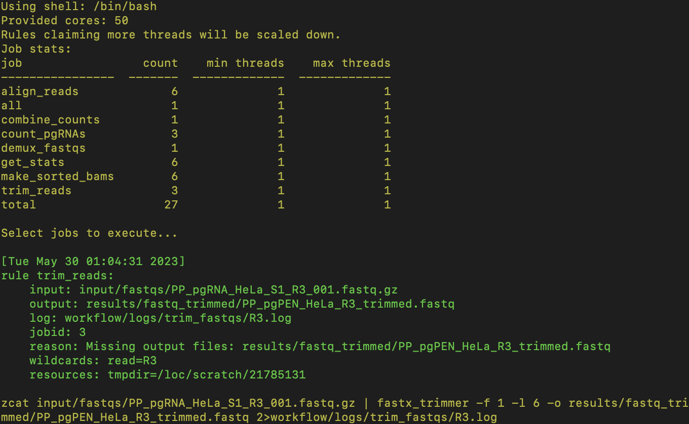
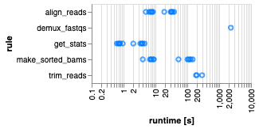

# pgMAP (paired guide RNA MAPper) Pipeline

From [pgMAP: a pipeline to enable guide RNA read mapping from dual-targeting CRISPR screens](https://arxiv.org/abs/2306.00944)

## Running the pipeline

1. Clone or fork the git repo from https://github.com/FredHutch/pgMAP_pipeline/ (if you are not sure of the difference between cloning and forking, check out the explainer [here](https://github.com/orgs/community/discussions/35849). Make sure you are on the main branch.


2. **First time only:** Build a Conda environment for Snakemake (defined by `workflow/envs/snakemake.yaml`, for more detail see the [Snakemake documentation](https://snakemake.readthedocs.io/en/stable/getting_started/installation.html)). Running your analysis within `snakemake_env` will enable you to use the same version of Snakemake and all other supporting packages that were used to develop pgMAP. To build the `snakemake_env`, do one of the following: 
   1. Install [Mamba](https://mamba.readthedocs.io/en/latest/), which is essentially a faster version of Conda that is used to run Snakemake, by doing one of the following:
      * If you **do not** already have the Conda package manager installed, [install Mambaforge](https://github.com/conda-forge/miniforge#mambaforge)
      * If you **do** already have Conda installed, run the following command: `$ conda install -n base -c conda-forge mamba`
   2. Next, create your Snakemake environment using Mamba by either:
      * Running the command `$ mamba env create -f workflow/envs/snakemake.yaml` from the main `pgMAP_pipeline` folder
      * Un-commenting line 5 in the script `run_snakemake.sh` (command: `$ mamba env create -f workflow/envs/snakemake.yaml`)


3. We suggest running the pgPEN tutorial, described below, in a separate folder before analyzing your own files. 


4. Once you've successfully run the tutorial, copy your input FASTQ files into the folder `input/fastqs/`. **Important note:** Your FASTQ filenames **must** include either `R1` and `R2` (for the two-read sequencing approach) or `R1`, `R2`, and `R3` (for the three-read sequencing approach). Additionally, all file extensions **must** include either `.fastq` or `.fq`. 


5. Duplicate and update the files in the `config/` folder as described below: 
    * Make a copy of `barcode_ref_file.sample.txt` named `barcode_ref_file.txt`. Update the sample and barcode information to match your experimental design and sequencing setup. Note that the barcode and sample ID **must be separated by a single tab**.
    * Make a copy of `config.sample.yaml` named `config.yaml`. Update the `base_filename` variable, the input file path (the default is `input/tutorial_fastqs`), and the number of chunks to split your BAM files into. We suggest trying `n_chunks: 50` for data from a full pgPEN CRISPR screen dataset. 


6. Run the script `run_snakemake.sh` by entering the command: `$ bash run_snakemake.sh`. The following steps will run automatically for all samples specified in `config/barcode_ref_file.txt`: 


### More information on installing/running/troubleshooting Snakemake
Install Snakemake v7.1.0 using mambaforge as described here:
https://snakemake.readthedocs.io/en/stable/tutorial/setup.html

Folder setup/running info as described here:
https://snakemake.readthedocs.io/en/stable/snakefiles/deployment.html

## pgMAP Tutorial
1. Downsampled pgPEN screen FASTQ files are used in the example, and can be found in the folder `input/tutorial_fastqs/`:

* `PP_pgPEN_HeLa_S1_R1_001.fastq.gz`
* `PP_pgPEN_HeLa_S1_R2_001.fastq.gz`
* `PP_pgPEN_HeLa_S1_R3_001.fastq.gz`

2. Make a copy of or rename `config/barcode_ref_file.sample.txt` as `barcode_ref_file.txt`, which is a file of sequencing barcodes:
```
CTTGTA   sample2
ACTTGA   sample1
GGCTAC   sample3
```
These barcodes are used in the demultiplexing step of the pipeline and are unique to each sample and condition. For the tutorial, you do not need to change the default values. 

3. Make a copy of or rename `config/config.sample.yaml` as `config.yaml`. For the tutorial, you do not need to change the default values. 

4. pgMAP is now ready to run. Execute `run_snakemake_test.sh` on an interactive compute node: 
```
$ bash run_snakemake.sh
```
pgMAP will automatically install all required packages with dependencies. Snakemake will print output as the processes run and detail each step, including any errors that arise:
&nbsp;&nbsp;&nbsp;&nbsp;&nbsp;&nbsp;&nbsp;&nbsp;&nbsp;&nbsp;&nbsp;&nbsp;&nbsp;&nbsp;&nbsp;&nbsp;&nbsp;&nbsp;

The resulting pgRNA counts can be found in `results/pgRNA_counts/pgMAP_tutorial_pgRNA_counts.txt`:

| id  | seq_1 | seq_2 | counts_sample1 | counts_sample2 | counts_sample3 | 
| ------------- | ------------- | ------------- | ------------- |------------- |------------- |
|AADAC_AADACL2_pg1   |AAGTCTGAAGCACTAAGAAG   |AAAGAAAGTCAGAAACCCGA|  5 |  6 |  4|
|AADAC_AADACL2_pg10	|ATTTCTATCCAAATCACTCA	|GAAAAAATTTGACTGCAGCA|  4 |  2 |  6|
|AADAC_AADACL2_pg11	|ATTTCTATCCAAATCACTCA	|GTGATGTATTCATCTGAAAG|	0 |  2 |  3|
|AADAC_AADACL2_pg12	|ATTTCTATCCAAATCACTCA	|TGGGGGCAATTTAGCAACAG|	1 |  2 |  1|
|AADAC_AADACL2_pg13	|GGTATTTCTGGAGATAGTGC	|AAAGAAAGTCAGAAACCCGA|	1 |  2 |  2|
|AADAC_AADACL2_pg14	|GGTATTTCTGGAGATAGTGC	|GAAAAAATTTGACTGCAGCA|	1 |  2 |  2|

To confirm that the correct counts were generated, you can compare your output to the file `results/expected_tutorial_output/expected_pgMAP_tutorial_pgRNA_counts.txt`.

Snakemake will also generate reports in `reports.html` and `workflow/report`:

&nbsp;&nbsp;&nbsp;&nbsp;&nbsp;&nbsp;&nbsp;&nbsp;&nbsp;&nbsp;&nbsp;&nbsp;&nbsp;&nbsp;&nbsp;&nbsp;&nbsp;&nbsp;&nbsp;&nbsp;&nbsp;&nbsp;&nbsp;&nbsp;&nbsp;&nbsp;&nbsp;&nbsp;&nbsp;&nbsp;&nbsp;&nbsp;&nbsp;&nbsp;&nbsp;&nbsp;&nbsp;&nbsp;&nbsp;&nbsp;&nbsp;&nbsp;&nbsp;&nbsp;&nbsp;&nbsp;&nbsp;&nbsp;&nbsp;&nbsp;&nbsp;&nbsp;&nbsp;&nbsp;

All log (`workflow/logs/`) and intermediate files (`results/`) are also accessible to users.

## Questions
Please contact Phoebe Parrish (developer) at pparrish@fredhutch.org, Daniel Groso (co-developer) at dgroso@fredhutch.org, or Alice Berger (Principal Investigator) at ahberger@fredhutch.org with any questions about pgMAP.

## License
pgMAP is available open-source under the MIT license. 

## Cite pgMAP
Please cite pgMAP as arXiv:2306.00944
