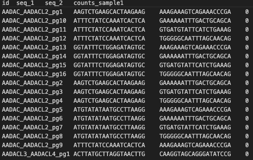
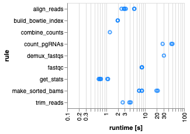

# pgMAP_pipeline

## Running the pipeline

1. Clone or fork the git repo from https://github.com/FredHutch/pgMAP_pipeline/ (if you are not sure of the difference between cloning and forking, check out the explainer [here](https://github.com/FredHutch/pgMAP_pipeline/)). Make sure you are on the main branch. 


2. Update the config files as described below: Duplicate the following files and edit them so that the barcodes and samples match those used in your sequencing run and all file paths point to your working directory:
    * Make a copy of `barcode_ref_file.sample.txt` named `barcode_ref_file.txt`. Update the sample and barcode information to match your experimental design and sequencing setup. 
    * Make a copy of `config.sample.yaml` named `config.yaml`. Update the `base_filename` variable, the read coordinates, and the number of chunks to split your BAM files into. 


3. **First time only:** Build a Conda environment for Snakemake (defined by `workflow/envs/snakemake.yaml`, for more detail see the [Snakemake documentation](https://snakemake.readthedocs.io/en/stable/getting_started/installation.html)). Running your analysis within `snakemake_env` will enable you to use the same version of Snakemake and all other supporting packages as we used when we developed pgMAP. To build the `snakemake_env`, do one of the following: 
   1. Install [Mamba](https://mamba.readthedocs.io/en/latest/), which is essentially a faster version of Conda that is required to run Snakemake, by doing one of the following:
      * If you **do not** already have the Conda package manager installed, [install Mambaforge](https://github.com/conda-forge/miniforge#mambaforge)
      * If you **do** already have Conda installed, run the following command: `$ conda install -n base -c conda-forge mamba`
   2. Next, create your Snakemake environment using Mamba by either:
      * Running the command `mamba env create -f workflow/envs/snakemake.yaml`
      * Un-commenting line 16 in the script `run_snakemake.sh` (command: `# mamba create -f $CONDA_ENV`)


4. Run the script `run_snakemake.sh` by entering the command: `bash run_snakemake.sh`


### More info on installing/running/troubleshooting Snakemake
Install Snakemake v7.1.0 using mambaforge as described here:
https://snakemake.readthedocs.io/en/stable/tutorial/setup.html

Folder setup/running info as described here:
https://snakemake.readthedocs.io/en/stable/snakefiles/deployment.html

## pgMAP Tutorial
1. In your pgMAP working directory, download the pgPEN screen downsampled fastq files [link to dropbox/other source] into `input/fastqs`:
  * PP_pgRNA_HeLa_S1_R1_001.fastq.gz
  * PP_pgRNA_HeLa_S1_R2_001.fastq.gz
  * PP_pgRNA_HeLa_S1_R3_001.fastq.gz

2. In `config/barcode_ref_file.txt`, paste the following:
```
CTTGTA  sample2
GGCTAC  sample3
ACTTGA  sample1
```

3. In `config/config.yaml`, ensure that variable `base_filename` corresponds to the string `PP_pgPEN_HeLa`.

4. pgMAP is now ready to run. Execute `run_snakemake_test.sh` on an interactive node or other served intended for computationally intensive tasks. Additionally, to execute a slurm job for pgMAP, run `run_snakemake_cluster.sh`.

The resulting pgRNA counts will be found in `results/pgRNA_counts`:

&nbsp;&nbsp;&nbsp;&nbsp;&nbsp;&nbsp;&nbsp;&nbsp;&nbsp;&nbsp;&nbsp;&nbsp;&nbsp;&nbsp;&nbsp;&nbsp;&nbsp;&nbsp;&nbsp;&nbsp;&nbsp;&nbsp;&nbsp;&nbsp;&nbsp;&nbsp;&nbsp;&nbsp;&nbsp;&nbsp;&nbsp;&nbsp;&nbsp;&nbsp;&nbsp;&nbsp;&nbsp;

All log and intermediate files are also accessible to users.

Additionally, Snakemake will generate an html-formatted report in `reports.html`:

&nbsp;&nbsp;&nbsp;&nbsp;&nbsp;&nbsp;&nbsp;&nbsp;&nbsp;&nbsp;&nbsp;&nbsp;&nbsp;&nbsp;&nbsp;&nbsp;&nbsp;&nbsp;;&nbsp;&nbsp;&nbsp;&nbsp;&nbsp;&nbsp;&nbsp;&nbsp;&nbsp;&nbsp;&nbsp;&nbsp;&nbsp;&nbsp;&nbsp;&nbsp;&nbsp;&nbsp;&nbsp;&nbsp;&nbsp;&nbsp;&nbsp;&nbsp;&nbsp;&nbsp;&nbsp;&nbsp;&nbsp;&nbsp;&nbsp;&nbsp;&nbsp;&nbsp;&nbsp;&nbsp;&nbsp;&nbsp;&nbsp;

## Questions
If you have any questions, please contact PCR Parrish at [email], (feel free to put Daniel's email if needed), or AH Berger at [email]

## License
pgMAP is available open-source under the MIT license. 

## Citations
Please cite [bioarchives link]


